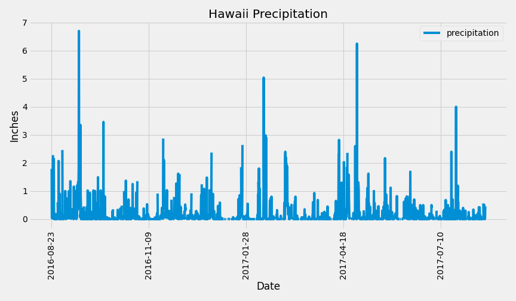
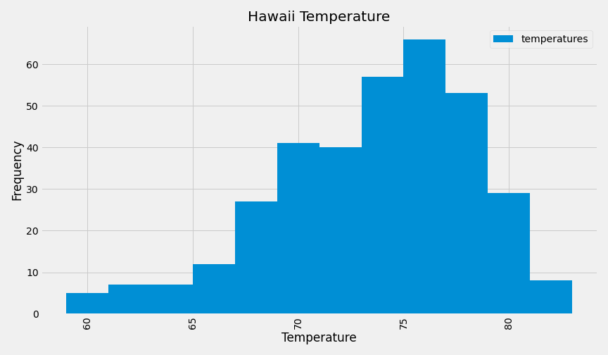
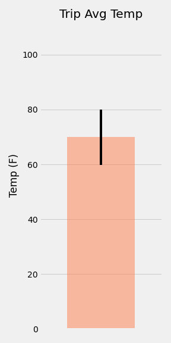
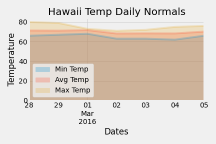

# Surfs Up!

Planning a trip to Hawaii? I've researched temperature and precipitation data. 

## Climate Analysis and Exploration

### Precipitation Analysis
Designed a query to retrieve the 12 most recent months of precipitation data from the dataset. 

### Station Analysis
Designed queries to compare stations reporting weather data and retrieve the 12 most recent months of temperature data from the dataset. 

### Climate App
Designed a Flask API for static and dynamic queries to return Hawaii weather data. 

### Additional Temperature Analysis
Compared temperatures in June and December and ran a t-test. 
Selected a date range for a trip and determined average, max, and min temps. 

Plotted Daily Normals: Min, Average, and Max Temps for Trip Dates. 

